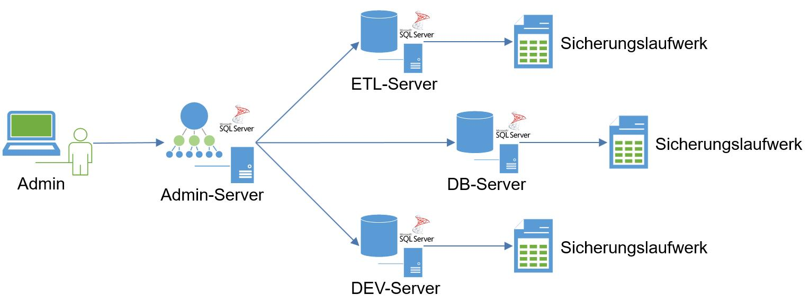
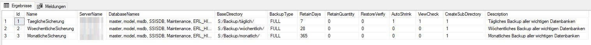

# SqlServerMaintenance #

Modern distributed maintenance framework for MS SQL Server.

## Description ##

This framework was developed for enhancing of build-in SQL Server maintenance. It contains a database definition with a set of tables, functions and procedures. This will fulfil some lack of funcationality which we have missed so far. This lacks are:

* **Verification** of backup files: The build-in SQL Server maintenance checksum is not enough because it will not determine file system errors. Only testing restore you can be 100% sure that your backup is OK.
* **Cleanup** of backup files: The build-in SQL Server maintenance mechanismn plans to clean old backups after backup job task. Sometimes space is not enough to create all backups before cleanup. Therefore it is better to  do a cleanup after each database backup. Additional to retain days this framework also supports definition of retain quantities.
* **Error Handling**: E-Mail notification and cleanup does not work in every scenario of SQL Server. This framework provides some error handling features which are more robust in case of errors.
* **Database care**: Creation of backups is not enough in maintenance. Also automatic shrinking and view verification are important steps which are provided in this framework.

Basic use case of this framework is creation of database backup files. The concept supports a distributed execution and monitoring of backup jobs with one central management instance for administraction and multiple sql server instances with different purposes.

This architecture allows to configure and monitor all backups at one point.

## Configuration Database ##
Mostly this framework is used by configuration of backup jobs in predefined tables (but all procedures can be used individually in custom workflow too).

* **BackupJobs**: Instead of build-in SQL Server maintenance jobs all jobs should be configured in table BackupJobs. The **DatabaseNames** contains a comma separated list of databases for which this job will be applied.

* **Config**: A simple KeyValue store for general configuration parameters.
* **BackupJobDetails**: Detail information about backup job executions with starttime, endtime and status.
* **BackupDetails**: Detail information about created backup files. 
* **BackupCheckDetails**: Detail information about applied check and verify scripts of backups.
* **ViewCheckDetails**: Detail information about applied view checks.
* **Log**: All messages of implemented logging framework will be inserted in this log table.

The **OperationId** is an auto-generated GUID which allows to define a relationship of a jobs and its (sub) tasks. Therefore it is possible to determine which checks and logs belong to which backup job.

## Basic funcationality ##

The main procedures which are uses to trigger backup jobs or to embed this framework in custom maintenance workflows are: 

* `sp_runBackupJob` or `sp_runBackupJobName`: Executes a backup job. Use this procedure in your scheduler for starting  youre defined backup jobs.
* `sp_createBackups` and `sp_createBackup`: Create a backup of one or multiple databases with enhanced features like restore verification, auto shrinking, view checks, notification, logging.

## Installation ##

For installation create a database and use provided deployment script. Adopt server and database name in connection definition for your requirements. After deployment you can configure your BackupJobs and schedule execution in SQL Server agent.

## Post Notes ##

* Author: Thomas Joscht
* Publish Date: 13.11.2020
